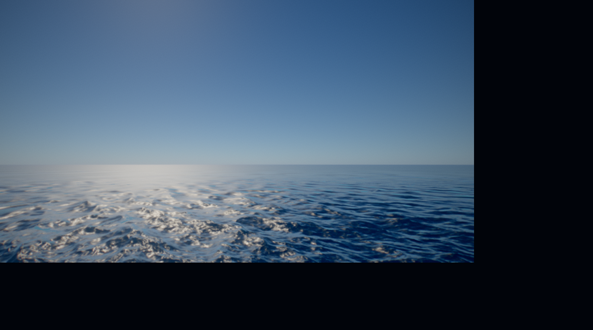
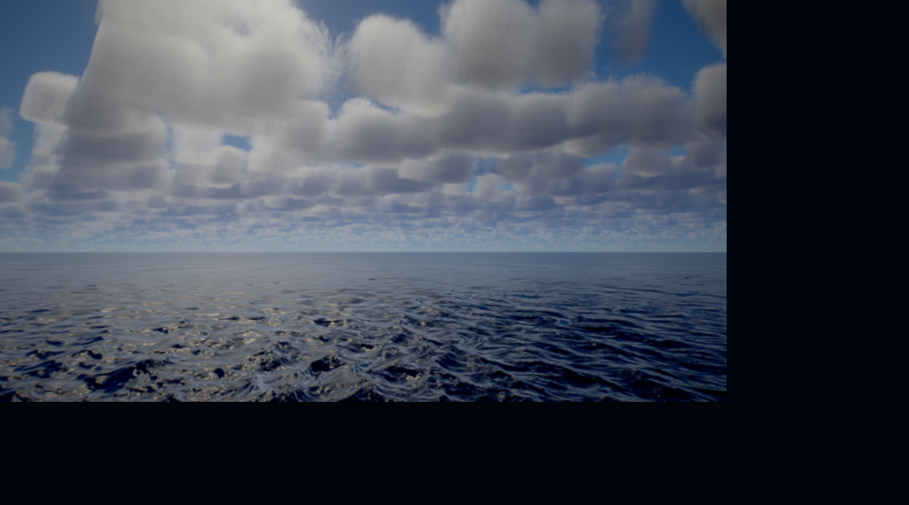
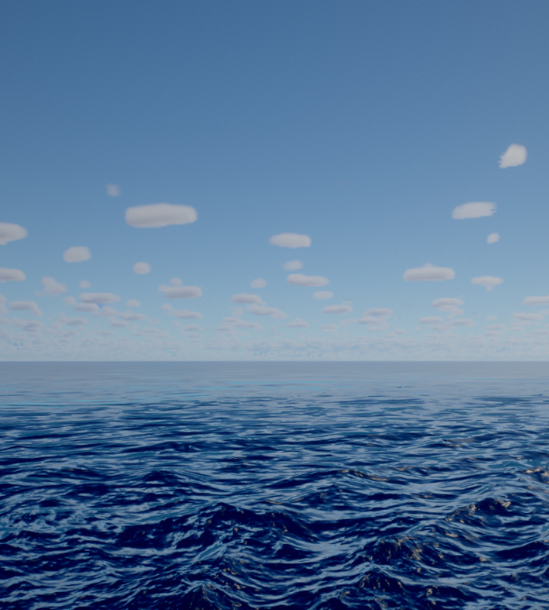
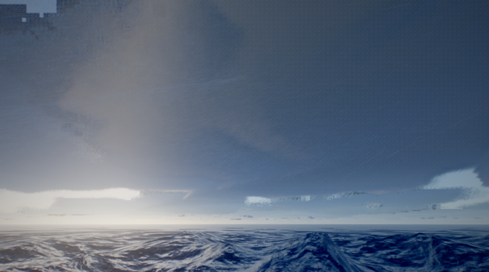
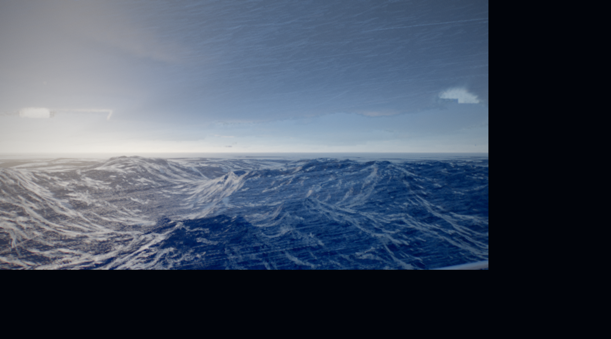

# ABYSSAL

**A fully procedural ocean and extreme weather simulation that runs in a browser tab.**

[](https://token-gremlin.github.io/natural-disasters/)
[](LICENSE)
[](https://github.com/Token-Gremlin/natural-disasters/actions/workflows/ci.yml)
[](https://threejs.org)
[](https://registry.khronos.org/webgl/specs/latest/2.0/)

### ▶ [Run it in your browser](https://token-gremlin.github.io/natural-disasters/)



ABYSSAL is a real-time cinematic ocean built entirely out of maths. There are no
textures, meshes, HDRIs or sound files in this repository — every wave, cloud,
foam streak, raindrop and lightning bolt is generated on the GPU at load time or
per frame. The whole thing is about 400 KB of JavaScript and GLSL.

It ships with two ways to experience it: an **automatic cinematic sequence** that
plays through a storm cycle on its own, and a **sandbox** where you fly the camera
yourself and trigger hurricanes, tsunamis and waterspouts wherever you are
looking.

---

## Contents

- [Highlights](#highlights)
- [Gallery](#gallery)
- [Quick start](#quick-start)
- [Controls](#controls)
- [URL parameters](#url-parameters)
- [Quality presets](#quality-presets)
- [How it works](#how-it-works)
- [Project layout](#project-layout)
- [Development tools](#development-tools)
- [Performance](#performance)
- [Browser support](#browser-support)
- [Contributing](#contributing)
- [License](#license)
- [References](#references)

---

## Highlights

**Ocean**

- Multi-cascade FFT wave simulation (swell, wind waves and ripples) driven by a
  JONSWAP spectrum with directional spreading, evolved on the GPU with a
  butterfly IFFT every frame.
- Foam accumulates and decays over time from surface Jacobian and wave
  steepness, so whitecaps build where the sea is actually breaking rather than
  being painted on.
- A screen-space projected grid keeps triangle density uniform in screen space
  and puts the horizon in the right place. View rays are raymarched and bisected
  against the analytic disaster field so a tsunami wall stays properly
  tessellated instead of tearing.
- Physically based water shading: GGX specular, Fresnel, subsurface scattering
  through backlit crests, depth-attenuated body colour, and anisotropic
  footprint-driven roughness so grazing angles do not speckle.

**Sky and atmosphere**

- Precomputed atmospheric scattering LUTs (transmittance, multiple scattering,
  sky view and aerial perspective) in the Bruneton / Hillaire style. The ocean,
  the clouds and the spray all take the sun through the same transmittance
  table, so a low sun reddens everything together.
- Raymarched volumetric clouds over a procedural Perlin-Worley volume, shaped by
  a synoptic weather map that gives the sky cell clusters and clear lanes tens
  of kilometres across. Cloud type ranges from stratus slab through fair-weather
  cumulus to cumulonimbus with an anvil.
- Moving cloud shadows on the water, sampled from the same weather map at the
  point where the sun's beam crosses the cloud base.

**Weather and disasters**

Torrential rain, wind-driven spray off the crests, volumetric lightning with
branching bolt geometry, waterspouts with a raymarched condensation funnel,
whirlpools, hurricanes with an eye and eyewall, rogue waves and tsunamis with an
asymmetric shoaling profile. Every one of them deforms the actual water surface.

**Rendering**

Temporal anti-aliasing, EV100 auto-exposure, bloom, depth of field, motion blur,
AgX and ACES tonemapping, contrast-adaptive sharpening, chromatic aberration,
film grain and vignette. Quality adapts at runtime to hold a frame budget.

---

## Gallery

| | |
|---|---|
|  |  |
| *Fair-weather cumulus, clear day* | *Trade wind, Beaufort 5* |
|  |  |
| *Cumulonimbus deck, violent storm* | *Beaufort 11, mountainous sea* |

---

## Quick start

The fastest way in is the [live build](https://token-gremlin.github.io/natural-disasters/) —
it is the same bundle, deployed straight from `main`. To run it locally you need
[Node.js](https://nodejs.org) 20.19+ or 22.12+.

```bash
git clone https://github.com/Token-Gremlin/natural-disasters.git
cd natural-disasters
npm install
npm run dev
```

Then open the URL Vite prints (usually <http://localhost:5173>).

To build a static bundle you can host anywhere:

```bash
npm run build     # outputs to dist/
npm run preview   # serve the built bundle locally
```

The build has no runtime dependencies beyond the bundled JavaScript — drop
`dist/` on any static host and it works.

---

## Controls

The demo opens in **cinematic mode**, which plays an automatic sequence of acts.
Press the **SANDBOX** button in the corner to take over.

### Camera (sandbox / free fly)

| Input | Action |
|---|---|
| Mouse drag, or click to lock the pointer | Look around |
| `W` `A` `S` `D` or arrow keys | Move |
| `E` or `Space` | Ascend |
| `Q` | Descend |
| `Shift` | Sprint (5×) |
| `Ctrl` | Crawl (0.18×) |
| Mouse wheel | Zoom (field of view) |

### Events

Each event spawns where the camera is looking and pulls the camera to a vantage
point that frames it.

| Key | Event |
|---|---|
| `1` | Lightning burst |
| `2` | Toggle rain |
| `3` | Waterspout |
| `4` | Maelstrom (whirlpool) |
| `5` | Hurricane |
| `6` | Rogue wave |
| `7` | Tsunami |
| `0` | Calm everything |

The sandbox panel also exposes condition presets (clear day, trade wind, golden
hour, overcast, squall, violent storm, night storm) and live sliders for sun
angle, cloud cover, cloud density, cloud base, anvil, haze, wind, swell,
choppiness, rain, spray, camera speed and zoom.

---

## URL parameters

| Parameter | Values | Effect |
|---|---|---|
| `preset` | `potato` `low` `medium` `high` `ultra` | Force a quality preset instead of auto-detecting from the GPU |
| `adaptive` | `0` | Disable runtime quality scaling (useful for benchmarking) |
| `profile` | `1` | Enable the per-pass GPU timer |
| `act` | integer | Jump straight to an act of the cinematic sequence |
| `director` | `0` | Disable the automatic director |
| `debug` | integer | Surface a debug channel (normals, foam, Fresnel, roughness, …) |
| `paused` | `1` | Boot paused |

Example: <http://localhost:5173/?preset=ultra&adaptive=0&profile=1>

---

## Quality presets

| Preset | Render scale | Ocean grid | FFT | Cloud steps | Rain + spray | Intended for |
|---|---|---|---|---|---|---|
| `potato` | 0.60 | 128 × 84 | 128 | 34 | 15 k | Software rendering, very old hardware |
| `low` | 0.72 | 176 × 110 | 128 | 48 | 38 k | Older integrated GPUs |
| `medium` | 0.85 | 240 × 150 | 256 | 66 | 88 k | Entry-level discrete GPUs |
| `high` | 1.00 | 340 × 210 | 256 | 96 | 176 k | Mainstream discrete GPUs |
| `ultra` | 1.00 | 480 × 300 | 256 | 148 | 330 k | High-end discrete GPUs |

`potato` also drops depth of field and motion blur. Temporal anti-aliasing stays
on at every preset, because the cloud march depends on it to resolve.

The preset is auto-detected from the unmasked WebGL renderer string. If the
frame budget is missed for long enough, adaptive quality first lowers the
internal resolution and then steps down a whole preset.

---

## How it works

Everything is generated at runtime. At boot the app bakes its own texture set —
foam and bubble rafts, ripple normals, a curl field, a synoptic weather map, a
128³ Perlin-Worley cloud shape volume and a 32³ detail volume — then solves the
atmospheric scattering LUTs. Nothing is fetched from disk.

**The ocean** is a sum of three FFT cascades at different spatial scales. Each
frame the spectrum is advanced in time and inverted with a butterfly IFFT into
displacement and derivative textures, from which the shader recovers normals and
the surface Jacobian. The Jacobian and the local wave steepness feed a foam
buffer that accumulates and decays, which is what makes whitecaps persist behind
a breaking crest instead of flickering.

The surface is drawn as a projected grid: a screen-space mesh whose vertices are
raycast onto the water plane, giving uniform pixel density and a correct horizon
at any altitude. Disaster events are analytic height fields evaluated in both
GLSL and JavaScript — the shader uses them to displace the surface, and the CPU
mirror lets the camera surf a tsunami instead of being swallowed by it.

**The clouds** are raymarched through a shell between the cloud base and top.
Coverage, type and base altitude come from the weather map; the Perlin-Worley
volume supplies the billow shape; two curl-warped octaves of the detail volume
erode the silhouette into cauliflower. Lighting is a short march toward the sun
with a Beer-Powder term and multiple scattering octaves. The march is amortised
over a 4×4 Bayer grid and reprojected temporally, then reconstructed to full
resolution with a Catmull-Rom bicubic filter that blends toward a wider kernel
only while the camera is moving.

**The frame** is rendered into an HDR target with a velocity buffer, resolved
with TAA, metered for auto-exposure through a log-luminance mip chain, then run
through bloom, depth of field, motion blur, tonemapping and sharpening.

---

## Project layout

```
src/
  main.js                 entry point and boot sequence
  core/
    App.js                render loop, resize, frame graph
    Quality.js            presets, GPU detection, adaptive scaling
    SharedUniforms.js     the single source of global uniform state
    GpuProfiler.js        per-pass timing via EXT_disjoint_timer_query_webgl2
  ocean/
    OceanFFT.js           spectrum, time evolution, butterfly IFFT cascades
    OceanMesh.js          projected grid, surface shading, event raymarch
    OceanSampleGLSL.js    shared sampling and disaster field functions
  sky/
    Atmosphere.js         scattering LUTs
    AtmosphereGLSL.js     shared atmosphere shader code
    SkyRenderer.js        sky dome and env probe
    Clouds.js             volumetric cloud march, reprojection, upsample
  weather/
    Weather.js            weather state and Beaufort mapping
    Director.js           cinematic acts, event spawning, CPU event field
    Lightning.js          branching bolt geometry and flicker
    Waterspout.js         raymarched condensation funnel
    Precipitation.js      rain streaks and crest spray
  post/
    PostFX.js             TAA, exposure, bloom, DOF, motion blur, tonemap
  camera/
    CinematicCamera.js    director shots, free fly, handheld shake
  gfx/
    ProceduralTextures.js all runtime texture baking
    NoiseGLSL.js          Perlin, Worley, curl and fBm
    ShadingGLSL.js        BRDF and irradiance helpers
    FullScreenPass.js     render target and pass plumbing
  ui/
    Overlay.js            cinematic HUD and debug panel
    Sandbox.js            interactive mode and event triggers
tools/                    headless test and image analysis harness
```

---

## Development tools

`tools/` holds a Puppeteer harness used to develop the renderer. It drives a
real GPU-backed Chrome, so it can catch shader compile failures, measure frame
times and take deterministic screenshots by pausing the simulation.

Start `npm run dev` first — the harness points at `localhost:5173` by default
and takes `--url` to point somewhere else.

```bash
# Drive the sandbox, capture named camera framings, print per-pass GPU timings
node tools/sb.mjs --tag test --look sky,sea,high --nohud

# Trigger an event and shoot it at a fixed simulation time
node tools/sb.mjs --tag tsu --do tsunami --cond storm

# Show the browser window instead of running it off-screen
node tools/sb.mjs --tag test --show
```

Image analysis helpers: `crop.mjs` magnifies a region, `diff.mjs` computes the
mean absolute difference between two captures, `seam.mjs` looks for suspicious
column discontinuities, `px.mjs` dumps pixel values along a scanline.

Captures land in `tools/shots/`, which is deliberately not tracked by git.

---

## Performance

Measured on an NVIDIA GeForce GTX 1650 at 1600 × 900, preset `high`, adaptive
scaling off:

| Scene | Median frame time | FPS |
|---|---|---|
| Clear day | 9.3 ms | 108 |
| Violent storm (cloud cover 0.74) | 13.8 ms | 72 |

Add `?profile=1` for a per-pass breakdown of where the frame goes.

---

## Browser support

Needs **WebGL2** with `EXT_color_buffer_float`. That covers current Chrome, Edge,
Firefox and Safari 15+ on desktop. A discrete GPU is recommended; integrated
graphics work at the lower presets.

Mobile is not a target. The projected grid and the cloud march are both far too
expensive for phone-class hardware at any useful resolution.

---

## Contributing

Contributions are welcome. Please read [CONTRIBUTING.md](CONTRIBUTING.md) for
how the project is organised, what a good change looks like and how to verify a
rendering change before opening a pull request. By taking part you agree to the
[Code of Conduct](CODE_OF_CONDUCT.md).

---

## License

[MIT](LICENSE) — free for any use, including commercially. Attribution is
appreciated but not required.

---

## References

The techniques here are built on published work:

- Jerry Tessendorf, *Simulating Ocean Water* — FFT ocean surfaces.
- Eric Bruneton and Fabrice Neyret, *Precomputed Atmospheric Scattering*.
- Sébastien Hillaire, *A Scalable and Production Ready Sky and Atmosphere
  Rendering Technique* (Eurographics 2020).
- Andrew Schneider and Nathan Vos, *The Real-time Volumetric Cloudscapes of
  Horizon: Zero Dawn* (SIGGRAPH 2015).
- Sébastien Lagarde and Charles de Rousiers, *Moving Frostbite to PBR* —
  physically based shading and EV100 exposure.
- Brian Karis, *High Quality Temporal Supersampling* (SIGGRAPH 2014).
- Troy Sobotka, *AgX* — the display transform.

Built with [Three.js](https://threejs.org) and [Vite](https://vitejs.dev).
