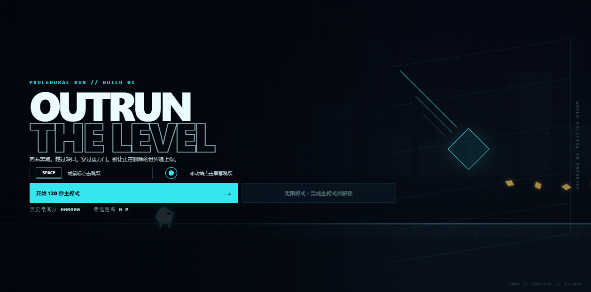

# OUTRUN THE LEVEL

> Project 001：研究如何把“实时生成关卡 + 身后删除浪 + 重力翻转”做成一款完整、可读且公平的 2.5D 横版自动跑酷游戏。

[在线游戏](https://yydshly.github.io/0828_codex_project/demos/outrun-the-level/) · [Web 研究总结](https://yydshly.github.io/0828_codex_project/projects/outrun-the-level/) · [返回研究总库](https://yydshly.github.io/0828_codex_project/) · [游戏源码](game/)

## 项目摘要

OUTRUN THE LEVEL 是 `0828 Codex Project` 下的第一个独立研究子项目，不是多个项目的拼接，也不是视觉演示。玩家控制发光角色自动向右奔跑，只通过一次跳跃输入应对实时生成的障碍、缺口、删除浪和可预判的重力门。

当前版本已经完成主界面、120 秒主模式、失败与即时重开、出口通关、无限模式解锁、分数和本地记录。

## 基本信息

| 字段 | 内容 |
| --- | --- |
| 项目编号 | 001 |
| 研究来源 | 原创玩法想法，无外部上游项目 |
| 版本 | v0.1.0 · 首个完整可玩版本 |
| 状态 | 已验证 · 进入真人试玩阶段 |
| 日期 | 2026-08-28 |
| 在线演示 | [开始游戏](https://yydshly.github.io/0828_codex_project/demos/outrun-the-level/) |
| Web 总结 | [提示词、意义、证据、价值与扩展方向](https://yydshly.github.io/0828_codex_project/projects/outrun-the-level/) |

## 提示词与研究问题

完整原始提示词及结构化拆解位于 [Web 提示词章节](https://yydshly.github.io/0828_codex_project/projects/outrun-the-level/#prompt)。它同时规定：

- 完整可玩，而非视觉演示；
- 桌面和移动端统一为单键跳跃；
- 实时生成、删除浪、失败、重开和本地记录；
- 120 秒流程，每 20 秒提升难度；
- 深色低噪背景，角色和危险保持醒目；
- 禁止无解组合、过量 Bloom、Ghost/幽灵对手和现有游戏素材模仿。

研究主要回答：单键跳跃能否支撑完整流程；程序化生成能否持续公平；重力门能否提前识别；删除浪、障碍、出口和即时重开能否形成清晰闭环。

## 当前实现

游戏位于 [`game/`](game/)，使用零外部依赖的原生 HTML、CSS 和 Canvas 2D，包含：

- 120 秒主模式及每 20 秒阶段提升；
- 安全模板驱动的实时关卡生成；
- 重力翻转、倒挂跑酷与恢复；
- 删除浪、碰撞、掉出跑道三类失败；
- 桌面键盘/鼠标和移动端触控；
- 分数、距离、收集物、最高分和无限模式解锁；
- 主界面、结算、即时重开及返回研究总结入口。

## 验证结果

| 检查项 | 结果 |
| --- | --- |
| 完整主流程 | 120 秒 |
| 阶段提升 | 每 20 秒一次 |
| 双重力门固定种子 | 20/20 通过 |
| 出口与无限模式解锁 | 10/10 通过 |
| 静态完整性检查 | 11/11 通过 |
| 浏览器页面与控制台错误 | 0 |
| 响应式视口 | 1280×720、820×1180、390×844 通过 |

结论：玩法闭环已经成立。限制：当前公平性仍主要由模板边界和自动化种子覆盖保证，需要真人试玩校准跳跃手感和后 60 秒密度。

## 本地运行

从仓库根目录运行完整 Pages 结构：

```powershell
npm run test:project-001
npm run build:pages
npm run preview:pages
```

访问：

- `http://127.0.0.1:4173/projects/outrun-the-level/`
- `http://127.0.0.1:4173/demos/outrun-the-level/`

也可只运行游戏：

```powershell
cd projects/outrun-the-level/game
npm start
npm run check
```

## Web 与部署映射

| 仓库内容 | 发布路径 |
| --- | --- |
| `docs/index.html` | `/0828_codex_project/` |
| `docs/projects/outrun-the-level/` | `/0828_codex_project/projects/outrun-the-level/` |
| `projects/outrun-the-level/game/` | `/0828_codex_project/demos/outrun-the-level/` |

Pages 由 [`scripts/build-pages.mjs`](../../scripts/build-pages.mjs) 组装，并通过 [GitHub Pages 工作流](../../.github/workflows/pages.yml) 发布。

## 价值与下一步

- 游戏设计：提供可持续调参的单键跑酷基线。
- 工程：固定时间步、种子化生成和浏览器测试接口让问题可复现。
- 展示：访问者可以直接试玩研究结果。
- 复用：公平模板、输入缓冲、风险预告和即时重开可迁移。

下一步邀请真实玩家完成 5–10 局，记录失败位置、原因、重开率和通关率，再据此调整后 60 秒；在数据出现前不优先增加更多机制、排行榜或账号系统。

## 资料与回滚

- [首屏截图](assets/menu-check.png)
- [游戏实现](game/)
- [静态检查](game/tests/static-check.mjs)
- [Web 研究总结源码](../../docs/projects/outrun-the-level/index.html)



`main` 的相关变更会触发 Pages 部署。线上出现问题时，对发布提交执行 `git revert`，由同一工作流重新部署可追溯的前一状态。
