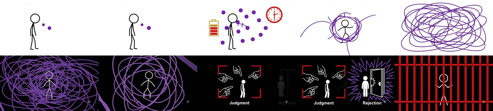

# DIRECTOR AS COMPILER

> Project 008：固定研究 `kaomei/stickman-video-director`，通过两条上游视频、一条覆盖前两幕的用户实测视频、三个代表性叙事案例和可操作的审批/Prompt 编译台，判断它如何把想法组织成火柴人视频生产包，以及这套方法如何迁移到我们的自有风格和执行链。

[在线研究演示](https://yydshly.github.io/0828_codex_project/projects/stickman-video-director-study/) · [查看我们的 20 秒实测](https://yydshly.github.io/0828_codex_project/projects/stickman-video-director-study/#user-sample) · [返回研究总库](https://yydshly.github.io/0828_codex_project/) · [原始仓库](https://github.com/kaomei/stickman-video-director)

## 基本信息

| 项目字段 | 内容 |
| --- | --- |
| 项目编号 | 008 |
| 研究对象 | `kaomei/stickman-video-director` |
| 固定方式 | Git submodule：[`source`](./source) |
| 审计提交 | `main@6d7f8c83a16c594c23bb73da832c8864ccd2aeb5` |
| 审计日期 | 2026-08-29 |
| 上游许可证 | MIT |
| 研究方法 | 完整阅读 `SKILL.md`、导演预案合同、生产 Prompt 合同、完整示例、测试场景与 rubric；运行上游 README 合同；核对两条官方 MP4；审计一条用户外部生成的 20 秒 MP4；建立三案例导演模拟、三风格适配原型、3×3 A/B 协议与真实浏览器验证 |
| 当前判断 | 架构参考价值高；直接成片价值中等；底层视频模型能力新增为零 |

## 一句话结论

它的本质不是火柴人生成模型，而是一套 **idea-to-video 导演控制层**：

```text
文案 / 主题
→ 130–150 词英文旁白
→ 六幕导演预案
→ 用户明确确认
→ 六条独立视频生成 Prompt
→ 外部视频模型生成
→ 外部拼接与音频统一
```

火柴人是当前视觉实现；真正值得我们参考的是中间的导演协议、批准门、画幅重构、独立 Prompt 锁定和镜头连续性设计。

## 必要理解

1. **它是导演规则，不是视频生成器。** 它负责内容重构、六幕分镜、节拍、连续性和生产 Prompt，最终像素由外部视频模型生成。
2. **火柴人是默认视觉语言，不是能力本体。** 当前合同用简单人物、有限颜色、图形和运动隐喻表达抽象内容；这部分可以替换成我们的风格包。
3. **Phase A 用于审核“讲什么”。** 六幕预案先确认旁白、镜头职责与衔接，不应把整张预案直接当作一条总生成 Prompt。
4. **Phase B 用于告诉模型“这一幕怎么生成”。** 通常逐镜头复制独立生产合同；但真实模型也可能返回覆盖两幕的更长结果，需要按输出重新审计，而不是机械假定每次恰好十秒。
5. **成片生产仍在仓库之外。** 模型调用、重做、旁白核验、BGM 统一、剪切和拼接都需要外部平台或我们后续建设的执行层。

一句话使用方法：**先批准六幕故事，再逐镜头生成；每次拿到真实输出后重新判断它覆盖了哪一幕、从哪里接下一幕。**

## 已获取的上游子项目

上游保存在 [`source`](./source)，保留独立版本历史和 MIT 许可证。固定提交包含：

- 60 行入口 [`SKILL.md`](./source/skills/directing-stickman-videos/SKILL.md)；
- 113 行[导演预案合同](./source/skills/directing-stickman-videos/references/storyboard-template.md)；
- 104 行[生产 Prompt 合同](./source/skills/directing-stickman-videos/references/omni-flash-prompt-contract.md)；
- 213 行[完整端到端示例](./source/skills/directing-stickman-videos/references/examples.md)；
- [行为评分规则](./source/tests/evaluation-rubric.md)与五组场景测试；
- 明暗主题 GIF/MP4 官方展示素材。

仓库没有 `package.json`、模型权重、视频 SDK、API 客户端、自动剪辑器或运行服务。它可以在没有 API 和 MCP 的情况下作为 Codex Skill 使用，但最终视频仍需在其他界面或服务中生成。

机器可读审计位于 [`upstream-audit.json`](./experiments/upstream-audit.json)。

## 它提供的能力

### 1. 内容重构

把文案、笔记、文章或短主题重写为约 55–65 秒、130–150 个英文单词的自然旁白。长素材会去除重复支线，短素材会用相关例子、递进、重新框定或结尾回扣扩展，但不得编造研究、数字、引语或产品卖点。

它内置三种叙事结构：

- 励志：强钩子 → 共鸣 → 升级 → 重构 → 行动 → 回报与 CTA；
- 教育：意外钩子 → 设置 → 机制 → 后果 → 实际意义 → 要点；
- 商业：痛点 → 后果 → 产品揭示 → 机制 → 证据或用例 → 收益与 CTA。

### 2. 六幕导演预案

一分钟被固定拆成六个约十秒片段，每幕包含：

- `0–3s`：建立或继承视觉前提；
- `3–7s`：转化、升级或解释隐喻；
- `7–10s`：产生高潮并创建下一次转场；
- 至少四种内容相关视觉设备；
- 每两到三秒一个可感知变化；
- 英文 VO、中文参考、BGM、SFX 和首尾衔接。

### 3. 真正的画幅重构

- `16:9`：左—中—右调度、侧向跟拍、水平匹配剪辑和负空间；
- `9:16`：前后景纵深、层叠运动、垂直揭示和界面安全区；
- `1:1`：中心加权、短运动路径和放射或环形变化。

改变画幅不能只替换标签；必须重新设计空间调度、镜头路径、转场几何和文字安全区。

### 4. 显式批准门

输入缺少素材、画幅或明暗主题时必须停止并一次性询问。Phase A 导演预案没有获得明确批准前，不能进入 Phase B。修改画幅、主题、旁白、场景结构或全局风格会使旧批准失效。

### 5. 独立生产 Prompt

六段视频通常独立生成，所以每条 Prompt 都重复：

- 时长、画幅、分辨率目标和帧率；
- 背景与线稿极性；
- 人物比例、线宽和造型；
- 不超过三种强调色及语义；
- 三个时间节拍；
- 精确且仅出现一次的音频旁白；
- 统一叙述者、BGM、SFX 和混音；
- 上一幕首帧继承和下一幕尾帧交接；
- 禁止文字、字幕、logo、异常人体和风格漂移的负面约束。

### 6. 连续性与拼接建议

相邻片段通过姿势、物体、满屏颜色/形状、运动方向或镜头运动连接。最后再列出五个剪切点、短音频交叉淡化和连续旁白/BGM 建议。

## Project 008 代表性演示

专题页提供三层证据：上游官方素材、用户外部生成实测、Project 008 确定性研究模拟，三者不可混用。

### 上游真实素材

明暗主题两条 MP4 来自上游 `assets/readme/`，站点副本经过 SHA-256 核对：

| 主题 | 文件 | SHA-256 前缀 | 证据边界 |
| --- | --- | --- | --- |
| 白底黑线 | `light-theme-demo.mp4` | `1685de37` | 上游官方展示视频；不代表批量成功率 |
| 黑底白线 | `dark-theme-demo.mp4` | `8572376a` | 上游官方展示视频；不代表跨模型稳定性 |

### 我们的首条真实生成样例

[专题页实测区](https://yydshly.github.io/0828_codex_project/projects/stickman-video-director-study/#user-sample)已接入用户提供的 `Create_an_approximately_sec.mp4`。机器可读审计位于 [`user-generated-sample.json`](./experiments/user-generated-sample.json)，关键事实如下：

| 字段 | 审计结果 |
| --- | --- |
| 文件 | 单一 MP4；H.264 视频 + AAC 音频 |
| SHA-256 | `5dd2efd0bbfc59b97c3697fb7bc42cf45632a3c2943f1fd0227e199a3ab25249` |
| 时长 / 规格 | 20.01 秒；1280×720；24 FPS；480 帧 |
| 对应内容 | 励志案例 CLIP 01 / Hook + CLIP 02 / Escalation |
| 强视觉切换 | 约 8.58 秒，由紫色思绪线团进入失败、评判、拒绝与红色牢笼 |
| 下一幕交接 | 以“红色牢笼困住人物”的可见状态承接 CLIP 03 |



这条样例证明导演预案中的前两幕职责可以在真实外部输出中被识别，并且紫色线团形成了可读的连续性桥。它不能证明平台究竟是内部拼接还是一次生成，也不能证明模型版本、成本、重试次数、旁白准确度或批量稳定性；这些原始调用信息尚未记录。

### 三个研究案例

机器可读数据位于 [`representative-cases.json`](./experiments/representative-cases.json)。

| 案例 | 叙事模式 | 默认画幅 / 主题 | 旁白词数 | 来源和作用 |
| --- | --- | --- | --- | --- |
| 别让“想太多”毁了你 | 励志 | `16:9` / dark | 143 | 压缩自上游完整示例；演示完整六幕、批准门与 Prompt 合同 |
| 引力是几何 | 教育 | `9:16` / light | 141 | 使用上游 application case 输入；演示不编造事实的抽象机制解释 |
| 从语音备忘到下一步行动 | 商业 | `1:1` / light | 132 | 使用上游 application case 输入；演示短产品概念的忠实扩展与中心构图 |

交互编译台支持：

1. 切换三个案例；
2. 检查每个案例的六幕预案、18 个节拍、VO 与首尾状态；
3. 切换 `16:9`、`9:16`、`1:1`，观察构图规则变化；
4. 切换明暗主题，观察背景和线稿合同变化；
5. 只有明确点击批准后才解锁单镜头生产 Prompt；
6. 选择六个镜头并复制其自包含生产合同；
7. 修改全局画幅或主题后，批准自动失效。

励志案例来自上游；科普和商业案例是 Project 008 根据公开合同进行的确定性研究重建。实验台不调用 LLM 或视频模型，不能作为真实渲染质量证据。

## 第二阶段：我们的风格适配原型

Project 008 已把“保留导演内核、替换火柴人风格”进一步落成机器可读原型：[`style-adapter-blueprint.json`](./experiments/style-adapter-blueprint.json)。它不是三套风格的生成结果，也不复制任何私有固定配方；用途是明确接口和批准边界。

当前研究适配器覆盖三个差异足够大的视觉方向：

| 适配器 | 适用内容 | 主要替换项 | 保持不变 |
| --- | --- | --- | --- |
| 极简冰蓝 / Editorial Ice Blue | 知识解释、产品逻辑、清晰信息 | 几何人物、冰蓝平面、图解式运动、克制视差 | 原意、VO、六幕职责、三个时间节拍、首尾语义 |
| 暗调黑红 / Dark Black-Red | 心理冲突、警示、力量感叙事 | 图形化人物、黑红极性、压力推进、红色转场物 | 同上，并保留批准谱系 |
| 东方青绿 / Oriental Blue-Green | 文化、人文、诗意知识 | 手绘简化主体、青绿矿物层、卷轴式揭示、低运动 | 同上，并禁止擅自增加文化或历史断言 |

批准被拆成两层：

```text
导演 Rxx 批准
→ 选择风格包，建立视觉 Rxx
→ 视觉批准
→ 选择目标模型 / 预算 / 获准参考资产
→ 才能形成真实后端生产请求
```

修改素材、旁白、画幅、六幕结构或全局叙事意图，会使导演批准与视觉批准同时失效；仅切换风格时，导演批准保留，只有视觉版本需要重审。这正是风格与导演真正解耦的操作含义。

### 可执行 A/B 协议

[`ab-execution-plan.json`](./experiments/ab-execution-plan.json) 已固定 3 个内容案例 × 3 套风格的 9 单元矩阵。每个单元在同一个视频后端、版本、时长、画幅、参考额度与预算下，对比：

- 直接单 Prompt 基线；
- 获批导演 Manifest + 风格适配合同。

六个核心指标是导演预案采用率、可用片段率、每成片分钟重做数、连续性失败率、单条采用成本和每成片分钟耗时。执行前仍需由我们确定目标后端与版本、预算上限、三套获准参考资产，以及叙事/风格/剪辑审核人。条件未确定前，本项目不会消耗生成额度，也不会用抽象预览冒充真实视频效果。

## 工作原理

它可以看作四层软程序：

| 层 | 上游资产 | 作用 |
| --- | --- | --- |
| Router | `SKILL.md` | 收集必需输入，管理 Phase A / B、批准与全局修改 |
| Intermediate representation | `storyboard-template.md` | 把内容变成可读、可确认的六幕导演中间层 |
| Target compiler | `omni-flash-prompt-contract.md` | 把获批场景编译成独立 Gemini Omni Flash Prompt |
| Behavior specification | `tests/scenarios`、`evaluation-rubric.md` | 描述 Agent 应遵守的输入门、批准门、重构与输出行为 |

这属于**上下文编程**：通用大模型读取 Markdown 规则并执行导演判断。它的优势是规则可读、可改、可分发；限制是遵循程度仍依赖 Agent，视频质量仍依赖外部模型。

## 使用场景

### 高匹配

- YouTube Shorts、TikTok、Reels 的知识解释和教育短片；
- 励志、心理、行动和习惯类内容；
- 用简单隐喻表达抽象概念；
- 把中文素材整理成英文视觉短片；
- 客户或团队在消耗生成额度前确认分镜；
- 使用统一火柴人语言进行账号批量内容生产。

### 条件匹配

- 中文或多语言成片：需要新的旁白、TTS 和字幕后期策略；
- 品牌自有风格或个人 IP：需要独立风格包、角色设定和参考资产；
- 多模型生产：需要模型适配器和真实回归；
- 三分钟以上内容：需要动态镜头数量、章节和上下文管理；
- 批量商业生产：需要队列、预算、重试、资产和人工抽检。

### 不适合直接承担

- 写实角色、复杂表演、多人对白和精确口型；
- 产品外观或 UI 的像素级演示；
- 依赖大量画内文字、技术标注和精确数据图；
- 跨镜头绝对身份、声音或音乐一致性保证；
- 没有人工审核的一键商业成片。

## 可扩展方向

### P0 · 结构化导演 Manifest

把 Phase A 从 Markdown 表格升级为 JSON Schema：source、narrative arc、VO、scene、beat、first/last frame、visual lock、audio、lineage 和 approval 都拥有稳定字段与版本。

### P1 · 自有风格路由器

保留通用导演内核，把火柴人替换为独立 style pack。每套风格定义人物、材质、线条、色彩语义、镜头语言、允许项、禁止项和参考资产职责。

### P2 · 多模型编译器

由同一导演 Manifest 编译到不同视频模型，分别处理时长、首尾帧、参考图、seed、音频、分辨率和负面约束，不把某个模型的 Prompt 方言写死在导演层。

### P3 · 自动执行与合成

接入生成 API、任务队列、预算、并发、失败重试、素材下载、TTS、连续 BGM、SFX、字幕后期和 FFmpeg 拼接，形成真正可复现的出片管线。

### P4 · 连续性与生成后 QA

保存人物设定、首尾关键帧、声音参考和场景状态；自动检查人物漂移、意外文字、旁白完整性、时长、画幅、色彩和相邻镜头匹配，驱动定向重做。

### P5 · 版本、反馈与分发

记录模型版本、Prompt、参数、成本、失败原因、用户修改和最终采用状态；自动输出横屏、竖屏、方形及不同平台的交付包。

## 对我们的参考价值

### 1. Skill 产品化方法

最值得复用的结构是：

```text
薄入口
→ 必需输入门
→ 分阶段 reference
→ 可审阅中间层
→ 显式批准
→ 自包含生产包
→ 失败与负面约束
→ 行为 rubric
```

这套结构可以迁移到我们的插画风格、个人 IP、产品视觉、视频分镜、游戏预演和生成式资产 Skill。

### 2. 风格与导演解耦

当前上游把火柴人规则和导演逻辑放在同一套合同里。我们的改造重点应该是把它们分开：

```text
通用导演核心
→ 我们的风格路由器
→ 风格配方 / 角色资产
→ 视频模型适配器
→ 生成、合成和 QA
```

这样同一选题可以在不同视觉风格之间复用导演意图，而不需要重新发明内容结构。

### 3. Prompt 只是控制层

它能降低内容平淡、提示词遗漏和流程失控的概率，但不能创造外部模型没有的角色一致性、物理、口型、文字或声音能力。评估时必须把“规则质量”和“模型能力”拆开。

## 对我们的后期使用价值

### 当前阶段：导演 benchmark

用它作为视频 Skill 的对照基线：同一主题分别用自由提示词、上游火柴人流程和我们的结构化导演流程制作样例，比较导演预案采用率、重做次数和生成成本。

### 近期阶段：自有风格预案器

把我们已有的固定视觉语言作为独立风格包，先用于选题、旁白、分镜和客户确认；即使尚未接入自动视频 API，也能减少前期沟通成本。

### 中期阶段：人工监督生产控制台

用结构化 Manifest 连接参考图、视频模型、TTS、BGM 和剪辑；每个镜头可单独重做，并保留版本、费用和批准状态。

### 长期阶段：多风格视频生产系统

导演核心面向内容，风格包面向审美，模型适配器面向执行，QA 面向可靠性。此时它不再是一条“火柴人 Prompt”，而是选题到成片之间可治理、可回归的中间层。

## 建议采用路线

1. 不直接把上游当成一键出片产品；把它作为导演工作流 benchmark；
2. 选一条知识解释、一条情绪故事和一条产品概念，使用两到三套我们的风格做同题 A/B；
3. 先记录导演预案采用率、平均重做镜头数、生成成本和最终可用率；
4. 若结构化流程明显减少重做，再实现 JSON Manifest 和第一套自有风格包；
5. 只有真实回归通过后，再投入多模型适配、自动合成和视觉 QA。

当前投入建议：**架构参考价值高，直接使用价值中等，长期作为自有导演控制层的价值高。**

## 成熟度与边界

- 固定提交只有 11 个历史提交，属于范围明确的小型 Skill；
- 上游 `verify-readmes.sh` 已通过六份 README 合同；
- 该 shell 测试检查多语言 README、章节、安装词与演示资产，不执行 Agent 或视频模型；
- scenario 和 rubric 是行为规范，不是自动 LLM 测试或视觉质量回归；
- 官方明暗视频证明视觉方向可实现，不证明跨主题、跨模型或批量成功率；
- 独立生成可能出现声音、音乐、人物和线条差异；
- Project 008 的网页模拟没有调用视频模型；现已收录一条用户在外部模型生成的 20 秒实测，但它不构成可重复性或批量效果承诺；
- 三套风格预览只是适配合同的抽象配色与层级示意，不是风格 Skill 或视频模型生成结果；
- 3×3 A/B 协议已经可执行，但在后端、预算、参考资产和审核人未定前保持 `ready_for_decision_not_executed`；
- MIT 允许使用、修改和分发，但应保留许可证与版权声明。

## 环境与复现

初始化上游 submodule：

```powershell
git submodule update --init --recursive
```

运行 Project 008 和完整站点验证：

```powershell
npm run test:project-008
npm run build:pages
npm run preview:pages
```

访问：

```text
http://127.0.0.1:4173/projects/stickman-video-director-study/
```

上游 README 合同在当前 Windows 环境通过 Git Bash 运行：

```powershell
& 'D:\tool\Git\bin\bash.exe' tests/verify-readmes.sh
```

## 资料与证据

- [上游 README](https://github.com/kaomei/stickman-video-director#readme)
- [上游 Skill](https://github.com/kaomei/stickman-video-director/blob/main/skills/directing-stickman-videos/SKILL.md)
- [导演预案合同](https://github.com/kaomei/stickman-video-director/blob/main/skills/directing-stickman-videos/references/storyboard-template.md)
- [生产 Prompt 合同](https://github.com/kaomei/stickman-video-director/blob/main/skills/directing-stickman-videos/references/omni-flash-prompt-contract.md)
- [完整端到端示例](https://github.com/kaomei/stickman-video-director/blob/main/skills/directing-stickman-videos/references/examples.md)
- [测试场景](https://github.com/kaomei/stickman-video-director/tree/main/tests/scenarios)
- [行为评分规则](https://github.com/kaomei/stickman-video-director/blob/main/tests/evaluation-rubric.md)
- [MIT License](https://github.com/kaomei/stickman-video-director/blob/main/LICENSE)
